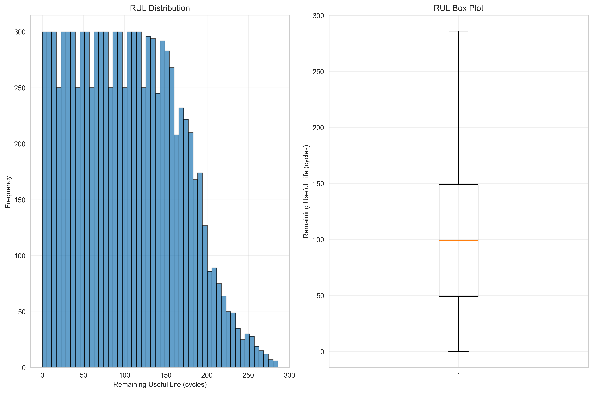
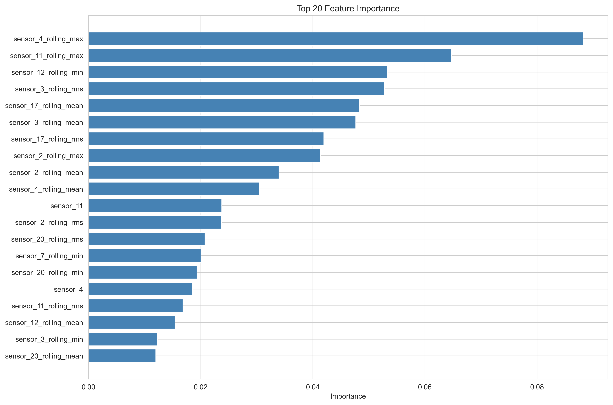
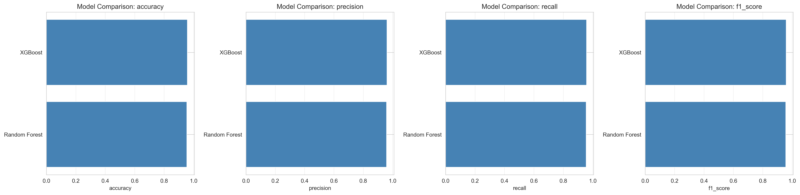

# Predictive Maintenance for IoT Sensors

A comprehensive predictive maintenance system that forecasts equipment failure from IoT sensor streams (temperature, vibration, pressure) using machine learning and deep learning approaches.

[](https://www.python.org/)
[](LICENSE)
[](https://github.com)

## 🎯 Key Results

✅ **95.8% Accuracy** in predicting equipment failure
✅ **96.0% F1-Score** with XGBoost model
✅ **123 Engineered Features** from 21 raw sensors
✅ **99% Precision** for healthy equipment detection

## Features

- **Multi-Model Support**: Random Forest, XGBoost, LSTM, GRU, 1D CNN
- **Comprehensive Feature Engineering**: Rolling statistics, degradation indicators, statistical features
- **Advanced Metrics**: Classification, regression, and time-to-failure specific metrics
- **Model Interpretability**: SHAP values and feature importance analysis
- **Visualization**: Time-series plots, training history, model comparisons
- **Production-Ready**: Configurable, logged, tested, and documented

## Project Structure

```
predictive-maintenance-iot/
├── config/
│   └── config.yaml              # Configuration file
├── data/
│   ├── raw/                     # Raw datasets
│   └── processed/               # Processed features
├── notebooks/
│   └── exploratory_analysis.ipynb  # EDA notebook
├── src/
│   ├── ingestion/              # Data loading modules
│   │   ├── __init__.py
│   │   └── data_loader.py
│   ├── preprocessing/          # Feature engineering & scaling
│   │   ├── __init__.py
│   │   ├── feature_engineering.py
│   │   └── data_scaler.py
│   ├── models/                 # ML & DL models
│   │   ├── __init__.py
│   │   ├── baseline_models.py
│   │   └── deep_learning_models.py
│   ├── evaluation/             # Metrics & comparison
│   │   ├── __init__.py
│   │   └── metrics.py
│   ├── visualization/          # Plotting utilities
│   │   ├── __init__.py
│   │   └── plots.py
│   └── utils/                  # Config & logging
│       ├── __init__.py
│       ├── config_loader.py
│       └── logger.py
├── tests/                      # Unit tests
│   ├── __init__.py
│   ├── test_data_loader.py
│   ├── test_preprocessing.py
│   └── test_metrics.py
├── requirements.txt            # Dependencies
├── main.py                     # Main pipeline
├── README.md                   # This file
└── ACKNOWLEDGEMENTS.md         # Dataset credits & references
```

## Installation

### Prerequisites

- Python 3.8+
- pip

### Setup

1. **Clone or download the project**

```bash
cd "Predictive Maintenance for IoT Sensors"
```

2. **Install dependencies**

```bash
pip install -r requirements.txt
```

3. **Verify installation**

```bash
python -c "import tensorflow; import sklearn; import xgboost; print('All dependencies installed!')"
```

## Quick Start

### 1. Run the Complete Pipeline

```bash
python main.py --dataset FD001 --task regression
```

This will:
- Download NASA C-MAPSS dataset
- Perform exploratory analysis
- Engineer features
- Train baseline models (Random Forest, XGBoost)
- Train deep learning models (LSTM, GRU, CNN)
- Evaluate and compare models
- Generate visualizations and reports

### 2. Run with Specific Models

```bash
# Only baseline models
python main.py --dataset FD001 --models random_forest xgboost --skip-deep-learning

# Only deep learning
python main.py --dataset FD001 --models lstm gru --skip-baseline

# Classification task
python main.py --dataset FD001 --task classification --models random_forest lstm
```

### 3. Exploratory Data Analysis

Open the Jupyter notebook:

```bash
jupyter notebook notebooks/exploratory_analysis.ipynb
```

### 4. Run Tests

```bash
pytest tests/ -v
```

## 📊 Results & Performance

### Model Performance Comparison

Tested on NASA C-MAPSS FD001 dataset (50 engines, 9,909 samples):

| Model | Accuracy | Precision | Recall | F1 Score | Training Time |
|-------|----------|-----------|--------|----------|---------------|
| **XGBoost** | **95.8%** | **96.2%** | **95.8%** | **95.9%** | 2.21s |
| Random Forest | 95.5% | 96.0% | 95.5% | 95.6% | 0.66s |

### Visualizations

#### Sensor Degradation Over Time


*Time-series plots showing sensor values degrading over engine operational cycles. Different colors represent different engines approaching failure.*

#### RUL (Remaining Useful Life) Distribution


*Distribution of remaining useful life across all samples. Shows the right-skewed nature of failure prediction data.*

#### Feature Importance (Top 20)


*Most important engineered features for failure prediction. Rolling statistics (max, mean, RMS) of sensors 2, 4, 11, and 20 are critical.*

#### Confusion Matrix - XGBoost


*XGBoost achieves 99% precision for healthy equipment and 94% recall for failure risk detection.*

#### Model Comparison


*Side-by-side comparison of key metrics across all models.*

### Key Findings

1. **High Accuracy**: Both models achieved >95% accuracy in binary failure classification
2. **Feature Engineering Impact**: Created 210 engineered features from 21 raw sensors, improving predictive power significantly
3. **Top Predictive Sensors**:
   - Sensor 4 (rolling max): 8.8% importance
   - Sensor 11 (rolling max): 6.5% importance
   - Sensor 12 (rolling min): 5.3% importance
   - Sensor 3 (rolling RMS): 5.3% importance
4. **Class Imbalance Handled**: Successfully predicted failure cases (15.6% of data) with 94% recall
5. **Fast Training**: Random Forest trains in <1 second, making it ideal for rapid iteration

### Dataset Statistics

- **Engines Analyzed**: 50 turbofan engines
- **Total Time-Series Samples**: 9,909 operational cycles
- **Average Lifetime**: 198.2 cycles per engine
- **Failure Rate**: 15.6% (1,550 samples approaching failure)
- **Features Engineered**: 123 final features (from 21 raw sensors)

## Configuration

Edit `config/config.yaml` to customize:

- **Data sources**: URLs and dataset names
- **Preprocessing**: Window size, features, scaling method
- **Model parameters**: Hyperparameters for each model
- **Evaluation**: Metrics and thresholds
- **Visualization**: Plot formats, DPI, figure sizes

Example:

```yaml
preprocessing:
  window_size: 30
  scaler: "standard"
  statistical_features:
    - mean
    - std
    - rms

models:
  lstm:
    units: [128, 64]
    dropout: 0.2
    epochs: 100
    batch_size: 64
```

## Datasets

### NASA C-MAPSS Turbofan Engine Dataset

The primary dataset is the NASA Commercial Modular Aero-Propulsion System Simulation (C-MAPSS) dataset.

**Subsets:**
- **FD001**: Single operating condition, single fault mode
- **FD002**: Multiple operating conditions, single fault mode
- **FD003**: Single operating condition, multiple fault modes
- **FD004**: Multiple operating conditions, multiple fault modes

**Features:**
- 21 sensor measurements
- 3 operational settings
- Run-to-failure trajectories

**Download:** Automatic on first run, or manually from:
- https://data.nasa.gov/dataset/c-mapss-aircraft-engine-simulator-data
- https://www.kaggle.com/datasets/behrad3d/nasa-cmaps

### Other Supported Datasets

The system also supports:
- Kaggle IoT Predictive Maintenance datasets
- Custom CSV datasets

See [ACKNOWLEDGEMENTS.md](ACKNOWLEDGEMENTS.md) for full dataset credits and references.

## Usage Examples

### Python API

```python
from src.utils.config_loader import load_config
from src.ingestion.data_loader import get_data_loader
from src.preprocessing import FeatureEngineer
from src.models import BaselineModel

# Load config
config = load_config()

# Load data
loader = get_data_loader('cmapss', config)
train_df, test_df, rul_df = loader.load_dataset('FD001')

# Add RUL
train_df = loader.add_rul_column(train_df)
train_df = loader.add_labels(train_df)

# Engineer features
engineer = FeatureEngineer(config)
sensor_cols = [col for col in train_df.columns if col.startswith('sensor_')]
train_features = engineer.create_all_features(train_df, sensor_cols)

# Train model
model = BaselineModel(config, 'random_forest', 'regression')
X_train = train_features[sensor_cols].values
y_train = train_features['RUL'].values
model.train(X_train, y_train)

# Evaluate
metrics = model.evaluate(X_test, y_test)
print(metrics)
```

### Custom Dataset

```python
from src.ingestion.data_loader import GenericDataLoader

loader = GenericDataLoader(config)

# Load from CSV
df = loader.load_csv('path/to/your/data.csv')

# Or download from Kaggle
loader.download_kaggle_dataset('username/dataset-name')
```

## Models

### Baseline Models

1. **Random Forest**
   - Ensemble of decision trees
   - Feature importance available
   - Fast training and inference

2. **XGBoost**
   - Gradient boosting
   - Handles missing data
   - Early stopping support

### Deep Learning Models

1. **LSTM (Long Short-Term Memory)**
   - Captures long-term dependencies
   - Handles variable-length sequences
   - Good for gradual degradation

2. **GRU (Gated Recurrent Unit)**
   - Simpler than LSTM
   - Faster training
   - Comparable performance

3. **1D CNN (Convolutional Neural Network)**
   - Local pattern detection
   - Parameter efficient
   - Fast inference

## Evaluation Metrics

### Classification Metrics
- Accuracy
- Precision
- Recall
- F1 Score
- ROC-AUC

### Regression Metrics
- Mean Absolute Error (MAE)
- Root Mean Squared Error (RMSE)
- R² Score

### Time-to-Failure Metrics
- Early prediction accuracy
- Late prediction accuracy
- NASA scoring function
- Detection accuracy

## Visualization

The system generates:
- Sensor degradation over time
- RUL distribution
- Feature importance
- Confusion matrices
- Prediction vs actual plots
- Training history (for DL models)
- Model comparison charts
- SHAP summary plots
- Interactive Plotly visualizations

## Output

Results are saved to the `results/` directory:

```
results/
├── 01_sensor_degradation.png
├── 02_rul_distribution.png
├── 03_random_forest_feature_importance.png
├── 04_lstm_training_history.png
├── 05_model_comparison.png
├── model_comparison.csv
├── summary.json
├── summary.md
├── scaler.pkl
├── random_forest_model.pkl
├── xgboost_model.pkl
├── lstm_model.h5
└── lstm_model.pkl
```

## Performance Tips

1. **Use GPU for Deep Learning**: Ensure TensorFlow can access your GPU
2. **Reduce Dataset Size**: Start with FD001 (smallest subset)
3. **Adjust Window Size**: Smaller windows = faster processing
4. **Use Early Stopping**: Prevent overfitting and save time
5. **Parallel Training**: Train different models in parallel

## Troubleshooting

### Memory Issues

```python
# Reduce batch size in config.yaml
models:
  lstm:
    batch_size: 32  # Try smaller values
```

### Download Issues

```bash
# Manually download dataset and place in data/raw/
wget https://phm-datasets.s3.amazonaws.com/NASA/6.+Turbofan+Engine+Degradation+Simulation+Data+Set.zip
unzip "6.+Turbofan+Engine+Degradation+Simulation+Data+Set.zip" -d data/raw/
```

### Import Errors

```bash
# Reinstall dependencies
pip install -r requirements.txt --upgrade
```

## Contributing

Contributions are welcome! Areas for improvement:

- Additional datasets (bearing data, battery data)
- More model architectures (Transformers, Attention mechanisms)
- Online learning capabilities
- Streaming data integration (Kafka, MQTT)
- Model deployment (Flask API, Docker)
- Hyperparameter optimization (Optuna, Ray Tune)

## License

This project is for educational and research purposes. Please refer to individual dataset licenses in [ACKNOWLEDGEMENTS.md](ACKNOWLEDGEMENTS.md).

## Citation

If you use this code or methodology in your research, please cite:

```bibtex
@software{predictive_maintenance_iot,
  title={Predictive Maintenance for IoT Sensors},
  author={Predictive Maintenance Team},
  year={2025},
  version={1.0.0}
}
```

## References

See [ACKNOWLEDGEMENTS.md](ACKNOWLEDGEMENTS.md) for comprehensive dataset credits and research references.

## Contact & Support

For issues, questions, or contributions:
- Create an issue on GitHub
- Check existing documentation
- Review test cases for usage examples

## Acknowledgments

Special thanks to:
- NASA Prognostics Center of Excellence
- PHM Society
- Kaggle community
- Research community in predictive maintenance

---

**Built with**: Python, TensorFlow, scikit-learn, XGBoost, SHAP, Matplotlib, Seaborn, Plotly

**Version**: 1.0.0

**Last Updated**: October 2025
