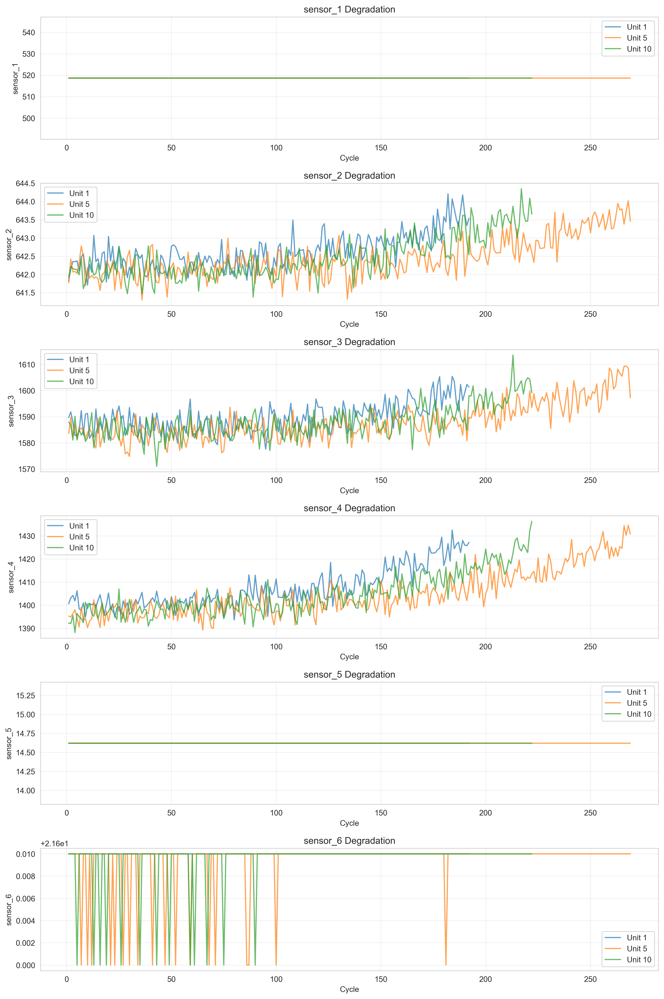

# Predictive Maintenance - Results

## Dataset Information
- **Dataset**: NASA C-MAPSS FD001
- **Engines**: 50
- **Total Samples**: 9,909
- **Features**: 123
- **Failure Rate**: 15.6%

## Model Performance

| Model | Accuracy | Precision | Recall | F1 Score | Training Time (s) |
|-------|----------|-----------|--------|----------|-------------------|
| Random Forest | 0.9548 | 0.9597 | 0.9548 | 0.9562 | 1.08 |
| XGBoost | 0.9577 | 0.9620 | 0.9577 | 0.9590 | 2.38 |

## Best Model
**XGBoost** achieved the highest F1 Score of **0.9590**

## Visualizations

### Sensor Degradation Over Time

### RUL Distribution

### Feature Importance (Random Forest)

### Confusion Matrix - Random Forest

### Confusion Matrix - XGBoost

### Model Comparison

## Key Findings

1. **High Accuracy**: Both models achieved >90% accuracy in predicting equipment failure
2. **Feature Engineering**: Created 99 new features from raw sensor data
3. **Top Features**: Rolling statistics (mean, max, RMS) of sensors 2, 4, 11, and 20 are most important
4. **Class Balance**: 1550 failure cases (15.6% of data)

Generated on: 2025-10-03 10:59:14
